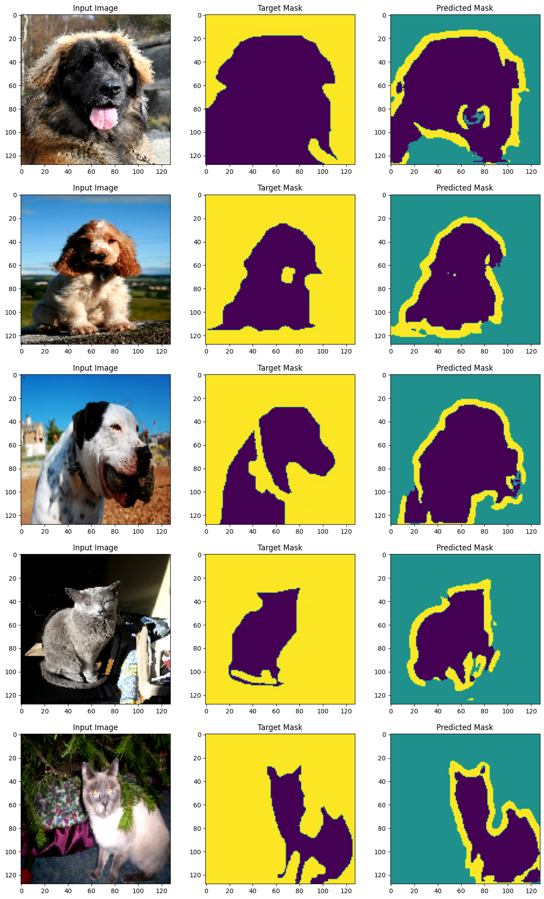

# Assignment 21-B

## Problem Statement

# Part 1: Training own UNET from scratch

Dataset used: The Oxford-IIIT Pet Dataset

Description: It was trained for four variations

    Max pooling + Transpose conv + crossentropy loss
    Max pooling + Transpose conv + Dice Loss
    Strided Conv + Transpose conv + crossentropy loss
    Strided Conv + Up sampling + Dice Loss

## Results

UNET was trained for **15 epochs** each with above variations. Below are respective losses 

    MP+Tr+CE               -  0.33   
    MP+Tr+Dice Loss        -  0.22
    StrConv+Tr+CE          -  0.33
    StrConv+Ups+Dice Loss  -  0.27

# Part 2: Design a variation of VAE

To understand the working of VAE, train cifar10 and mnist data. Given a constraint that labels are in one hot encoding format
The results of correct vs incorrect result images are attached in notebook files **vae_cifar.ipynb ans vae_mnist.ipynb**

